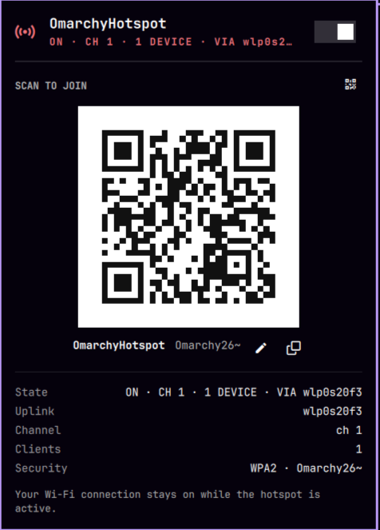

# Omarchy Hotspot

A **mobile hotspot that never drops your Wi-Fi**. One click in your Omarchy
bar turns this laptop into a Wi-Fi AP (`OmarchyHotspot`) that shares your
current connection — while the station link stays up the entire time.

  

<<<<<<< HEAD

=======

>>>>>>> 2574dd7 (docs: add hotspot-panel.png, README uses it)

*The hotspot popup: hero toggle, scannable QR code, and live connection details.*


## Features

- 🔥 **Concurrent STA+AP** — your existing Wi-Fi connection keeps working while clients join the hotspot. No radio juggling, no disconnects.
- 📱 **Scannable QR code** — join with any phone camera (`WIFI:T:WPA;S:OmarchyHotspot;P:…;;`), shown right in the popup.
- 🎛️ **Interactive panel** — hero toggle, live status (uplink, channel, connected clients), copy-password, keyboard navigation (`j/k`, `Enter`, `Esc`).
- 🌐 **Shares any uplink** — NAT follows the default route: Ethernet, phone tether, or a VLAN-tagged interface. Whatever carries your internet is shared.
- 🔒 **WPA2** with a persistent random password — **editable in the panel** (pencil icon → inline field; takes effect immediately, QR regenerates).
- ⚡ **Passwordless toggling** — a scoped polkit rule lets the bar widget drive the root helper without prompts.

## How it works

The AP runs on a **virtual interface** (`ap0`) alongside your station interface:

```
┌─────────────── phone ───────────────┐        ┌──────────── laptop ────────────┐
│  scan → WPA2 → DHCP → DNS → browse │  ════►  │ ap0 (hostapd + dnsmasq)        │
└─────────────────────────────────────┘        │      │ NAT (iptables MASQUERADE)│
                                               │      ▼                         │
                                               │ wlp0s20f3 (your Wi-Fi, stays up)│
                                               └────────────────────────────────┘
```

- **`hostapd`** serves the AP on `ap0` under a transient systemd unit
  (`omarchy-hotspot.service`) — journald logging, clean lifecycle.
- **`dnsmasq`** hands out `10.42.0.10–200` and resolves DNS
  (`omarchy-hotspot-dns.service`).
- **iptables** does NAT/forwarding, with an explicit INPUT accept on `ap0` —
  UFW's default DROP policy would otherwise eat client DHCP/DNS.
- The bar plugin (`local.hotspot`) polls `status` via `pkexec` and renders
  the popup with the QR matrix (qrencode → 0/1 modules, same format as
  `omarchy.wifiqr`).

## Requirements

- Omarchy (or any Hyprland + Quickshell setup), `iw`, `nmcli`, `qrencode`
- Packages: `hostapd`, `dnsmasq` (installed by `install.sh` via pacman)
- A Wi-Fi card whose driver supports **concurrent station + AP** on separate
  virtual interfaces. Verify with:
  ```sh
  iw list | grep -A3 "valid interface combinations"
  # look for: #{ managed } <= 1, #{ AP, ... } <= 1
  ```
  Intel AX200/AX210 (iwlwifi) work; the AP **must mirror the station's
  channel and channel width** (the helper does this automatically — a width
  mismatch makes iwlwifi silently refuse to beacon).

## Installation

```sh
git clone https://github.com/shivamnarkar47/omarchy-hotspot.git
cd omarchy-hotspot
./install.sh          # installs helper + polkit rule + NM config (asks for password)
omarchy plugin clone  # skip — plugin ships in ./plugin
cp -r plugin ~/.config/omarchy/plugins/local.hotspot
omarchy plugin enable local.hotspot --section right
```

`install.sh` does, with one password prompt:

1. Installs `hostapd` + `dnsmasq` (pacman)
2. Installs `src/omarchy-hotspot-helper` → `/usr/local/bin/`
3. Installs the polkit rule (passwordless `pkexec` for the helper only)
4. Tells NetworkManager to never touch `ap0` (it would force station mode)

## Usage

- Click the hotspot icon in the bar → panel opens.
- Flip the switch (or press `Enter`). Status shows uplink, channel, clients.
- Scan the QR with any phone, or join manually:
  - **SSID:** `OmarchyHotspot`
  - **Password:** shown in the panel (copy button included)
- Toggle off when done — your Wi-Fi was never interrupted.

## Troubleshooting

| Symptom | Cause / fix |
|---|---|
| Phone can't see the AP | AP channel width ≠ station width. Recreate the profile / check `journalctl -u omarchy-hotspot`. |
| Connects but no internet | Check `iptables -L INPUT -n` — UFW's DROP policy must not cover `ap0` (the helper inserts an ACCEPT). |
| `nl80211: Match already configured` | The `ap0` vif must be `ip link set up` **before** hostapd starts (the helper does this). |
| No DHCP | `journalctl -u omarchy-hotspot-dns` — verify `--log-dhcp` shows DISCOVER → OFFER → ACK. |

## Extending

The plugin is a plain Quickshell bar widget:

```
plugin/
├── manifest.json   # id, kinds, bar-widget metadata
├── Panel.qml       # bar button + popup UI (hero, QR, details)
└── qr.sh           # QR matrix generator (WIFI: scheme)
```

Ideas: client list with MACs, per-client bandwidth, SSID/password settings
in `shell.json`, 5GHz band preference, WPA3, scheduled on/off.

## License

MIT
